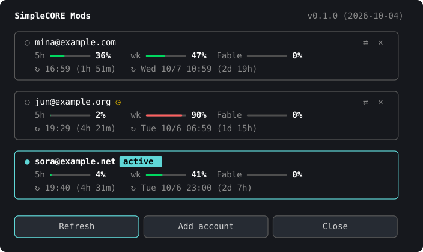
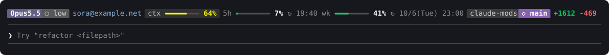
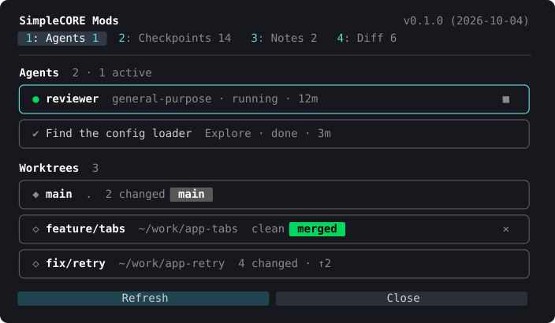

# SimpleCORE Claude Mods


Mods for [Claude Code](https://code.claude.com): plugins of function hooks that add panes, a status band and slash commands to the terminal. The repository is a local plugin marketplace, `simplecore-mods`, and every mod in it is a self-contained plugin under `mods/<name>/`. The mods share one look: the same header, cards, gauges, buttons and footer.

Installing the plugin `sc` installs every mod: it declares the `/sc:` commands and depends on the mods' own plugins.

| Mod | Plugin | Command | What it does |
| --- | --- | --- | --- |
| [Accounts](#accounts) | `sc-accounts` | `/sc:accounts` | Keeps several Claude logins, switches between them in one step, and shows every account's usage limits and the session status above the prompt |
| [Workspace](#workspace) | `sc-workspace` | `/sc:workspace` | One tabbed pane for the session's agents and worktrees, checkpoints of the working tree, notes, and the changes made |

Only macOS has been tested so far. The code paths for Linux, WSL and Windows exist but have not been run on those systems.

## Install

```bash
claude plugin marketplace add simplecore-inc/claude-mods
claude plugin install sc@simplecore-mods
```

`sc` brings `sc-accounts` and `sc-workspace` with it as dependencies. The plugins are installed for the user, so they run in every session wherever Claude Code is started. Run `claude plugin update <plugin>@simplecore-mods` and then `/reload-plugins` to take a new version.

### From a local clone

```bash
git clone https://github.com/simplecore-inc/claude-mods.git
claude plugin marketplace add ./claude-mods
claude plugin install sc@simplecore-mods
```

A plugin installed from a folder marketplace is read from that folder: after editing a mod, run `/reload-plugins` in a session to pick the change up, with no reinstall. To try a mod in one session without installing it, start Claude Code with `claude --plugin-dir ./claude-mods/mods/<name>`.

## Accounts

Plugin `sc-accounts`, folder `mods/accounts`.


Keeps several Claude logins on this machine, switches the running sessions to any of them the moment one is chosen, and keeps every account's five-hour, weekly and per-model usage in view. Runs on macOS, Linux, WSL and Windows, storing credentials where Claude Code itself does on each: the keychain on macOS, files under Claude Code's config directory elsewhere.





### Commands

| Command | What it does |
| --- | --- |
| `/sc:accounts` | Opens the accounts pane: one card per account, with switch, remove and refresh |
| `/sc:accounts list` | Prints every account with its limits and reset times |
| `/sc:accounts use <n\|email>` | Switches to an account by its number in the list, its email, or a prefix only one email starts with |
| `/sc:accounts remove <n\|email>` | Removes a saved account; the account in use cannot be removed |
| `/sc:accounts refresh` | Looks up every account's limits now, past the automatic schedule |
| `/sc:accounts add` | Explains how to add an account |
| `/sc:accounts band on\|off` | Shows or hides the status band above the prompt |

### Adding and switching accounts

1. The account you are logged in with is saved when the mod starts.
2. Log in to another account with `/login`. Within a minute the mod saves it as well.
3. Choose an account in the pane (`⇄`) or with `/sc:accounts use`. Every running Claude Code session on the machine uses it from its next request; nothing is restarted and no login is repeated.

Removing an account (`✕`, then `✕?` to confirm) deletes its saved credential (the keychain item on macOS, the vault file elsewhere). Using it again takes a new `/login`.

### What you see

- **The accounts pane** (`/sc:accounts`): a card per account with its usage bars. Under each bar is its reset time in local time and the time left, such as `↻ 10/7(Wed) 11:00 (2d 20h)`. Windows that reset together, such as the weekly limit and a model's weekly limit, share one card cell and one reset line. The pane header shows the mod's version and release date, as `v0.2.0 (2026-10-04)`.
- **The status band** above the prompt, on one line that wraps only when the terminal is too narrow: model and effort (or ULTRACODE) and fast mode, the current task, the live account, the session's context gauge, five-hour and weekly usage, the directory, branch and PR, and the lines added and removed.
- **`◷`** beside an account: its last lookup was rate limited, so the figures shown are the previous reading's. It clears on the next successful lookup.

### Settings

| Setting | Default | Where |
| --- | --- | --- |
| `showStatusBand` | on | `/config`, or `/sc:accounts band on\|off` |

With `showStatusBand` off, the band above the prompt is drawn by Claude Code as it is without the mod. Everything else keeps working.

The mod shows English, and Korean where Claude Code's `language` setting is Korean; any other language falls back to English. Without that setting, `LC_ALL`, `LC_MESSAGES` and `LANG` decide, in that order.

### The status line command

Some of what the band shows reaches only a status line command: fast mode, the PR, the lines changed, the effort level. To show them, configure a `statusLine` command that prints nothing and writes these fields of its input to `~/.claude/cache/statusline/<session_id>.json`. The mod reads that file every two seconds.

```json
{
  "updatedAt": 1791094518590,
  "model": "Opus 5.5",
  "effort": "low",
  "ultracode": false,
  "fast": false,
  "contextUsed": 28,
  "task": "",
  "dir": "claude-mods",
  "branch": "main",
  "pr": { "number": 12, "reviewState": "approved" },
  "linesAdded": 12,
  "linesRemoved": 3
}
```

Write it to a temporary name and rename it into place, so the mod never reads half a file. Without the file, the band shows the context, the account and its usage alone. The same command is the place for anything else that needs the status payload, such as a dashboard feed.

### How it works

- **Storage.** On macOS each saved account's OAuth credential is one keychain item under the service `account-switch`, keyed by account id, and the secret travels to `security` on stdin as hex, never in a command line. On Linux, WSL and Windows, where Claude Code keeps its own login in `~/.claude/.credentials.json`, each saved credential is `~/.claude/account-switch/<account id>.json` (`CLAUDE_CONFIG_DIR` replaces `~/.claude`); on Linux and WSL it is written owner-only (mode 600) through stdin, on Windows it inherits the profile directory's access list. The platform is read from `OS` (`Windows_NT`) and `uname -s` (`Darwin`). Only the account details that hold no secret (the `oauthAccount` value of `~/.claude.json`) are kept in the plugin store.
- **Switching.** On macOS the chosen credential is written to the keychain item Claude Code reads (`Claude Code-credentials`) and to `~/.claude/.credentials.json` when that file exists; elsewhere it is written to `.credentials.json`, and `oauthAccount` in `~/.claude.json` is set to the account's details. Claude Code compares the modification time of `.credentials.json` before it uses a token, so a running session drops its cached login and uses the new one from its next request. Where the file does not exist, the change lands once Claude Code's keychain cache expires (30 seconds).
- **Telling accounts apart.** When the login changes, the mod asks the profile endpoint whose token it is before filing it, so a token is never saved under the wrong account. Each account's usage is looked up with that account's own token.
- **Usage lookups.** The automatic lookup runs once every five minutes across the machine, and every running session shares its result. A 429 pauses automatic lookups for `Retry-After`, or without it for five minutes doubling up to an hour; Refresh in the pane and `/sc:accounts refresh` always look up at once.
- **The live account.** Its figures are updated from every response Claude Code receives and looked up every two minutes when there is none. A response to a turn that began before the account changed belongs to the previous account, so it prompts a lookup instead of being applied.
- **Token refresh.** When an inactive account's access token nears expiry, the mod refreshes it and saves the rotated refresh token. The live account's token is Claude Code's to refresh and is never touched. An account whose refresh is refused asks for a new login.

### Caveats

- The usage lookup (`/api/oauth/usage`), the profile lookup and the token refresh use endpoints with no public documentation, which may change without notice.
- One login is active per machine: switching moves every running Claude Code session to the chosen account.

## Workspace

Plugin `sc-workspace`, folder `mods/workspace`. One pane with four tabs, opened with `/sc:workspace`; a digit (1 to 4) switches tabs.



| Command | What it does |
| --- | --- |
| `/sc:workspace` | Opens the pane on the tab last shown |
| `/sc:workspace agents\|checkpoints\|notes\|diff` | Opens the pane on that tab |
| `/sc:workspace notes <text>` | Adds a note and opens the Notes tab |

### Tabs

- **Agents.** The session's subagents and teammates: a coloured mark for the status (running `●`, waiting `◐`, done `✔`, failed `✖`), the type, and how long ago it started. A running one can be stopped (`■`, then `■?` to confirm). Below are the repository's worktrees: branch, path, changed files, and commits ahead (`↑`) and behind (`↓`) the main branch. A worktree that is clean and merged is marked `merged` and can be removed (`✕`, then `✕?`), its branch with it.
- **Checkpoints.** A snapshot of the working tree is taken before every prompt, and when the session starts. Each row shows when it was taken, the prompt it came before, and what changed since: files, lines added and removed. `Δ` opens the Diff tab against that checkpoint; `↺` opens a dialog that names the checkpoint and what restoring would undo, and Restore (or Enter) puts the working tree back to it. A "Before restore" checkpoint is taken first, so the restore can be undone; Esc or Cancel closes the dialog. Checkpoint now takes one at once.
- **Notes.** A scratchpad for what to remember in this project: follow-ups, ideas, instructions for Claude. Notes stay with the project across sessions. Write one in the bordered field (`✎`) and press Enter, or run `/sc:workspace notes <text>`. `↵` puts a note in the prompt; with the **Send with prompts** switch on (the `notesInContext` setting, flipped from the tab), Claude gets the open notes with every prompt. `☐` marks a note done: it moves to the Done group, struck through, and is no longer sent. `✕` (then `✕?`) deletes it.
- **Diff.** The files changed since the session started, or since the checkpoint chosen with `Δ`: a status letter (A, M, D, R), the path, a bar of lines added and removed, and the counts. Pressing a file shows its diff below.

### Settings

| Setting | Default | What it does |
| --- | --- | --- |
| `checkpointEveryPrompt` | on | Takes a checkpoint before every prompt |
| `notesInContext` | off | Hands the project's open notes to the model with every prompt |

### How it works

- **Checkpoints are git objects.** A snapshot is built in an index of its own (`GIT_INDEX_FILE`), with tracked and untracked files and ignored ones left out, then kept as a commit under `refs/sc/checkpoints/<session>/<n>`. The user's staging area, branches and stash are never touched. The newest 50 checkpoints per project are kept; older ones lose their refs.
- **Restoring** writes back every file the checkpoint holds (`git restore --source`) and removes the files made since it. Ignored files are left alone.
- **Agents** come from Claude Code's own list of the session's agents, read every three seconds; stopping one calls Claude Code's `TaskStop` tool, with its usual permission check.
- **Worktrees** come from `git worktree list`; a worktree is removed with `git worktree remove` (never forced) and its branch with `git branch -d`, which refuses an unmerged branch.
- Outside a git repository the Agents tab still lists agents; the other tabs say that they need a repository.
- Restoring removes the files made since a checkpoint with `rm`, which Windows has only under WSL.

## Developing a mod

### Layout

```
.claude-plugin/marketplace.json   the marketplace: one entry per mod
mods/sc/                          the bundle: the /sc: commands, and every mod as a dependency
shared/                           code every mod uses: UI pieces, layout, time, locale
scripts/sync-shared.mjs           copies shared/ into each mod's hooks/shared/
mods/<name>/
  .claude-plugin/plugin.json      the manifest: name, version, userConfig
  CHANGELOG.md                    one "## <version> (<YYYY-MM-DD>)" heading per release
  commands/<command>.md           slash commands, answered by a command.run hook
  hooks/hooks.json                points at the hooks module
  hooks/register.tsx              every hook, and every call on $
  hooks/*.ts                      pure functions that never touch $
  hooks/views/*.tsx               what the pane draws, from the element table and plain data
  hooks/shared/                   copies of shared/, written by the sync script
  types/index.d.ts                the $.state contract
  tests/*.test.ts(x)              run by `claude plugin test`
```

### Rules the engine enforces

- **Commands.** A command is declared as `commands/<command>.md` and answered by a `command.run` hook. Claude Code registers it as `/<plugin>:<command>`, so `commands/accounts.md` in the plugin `sc` is `/sc:accounts`. A name given to `$.command.register` cannot hold a `:`.
- **`$` stays in one file.** `$`, the engine interface, cannot be passed to a function imported from another file; `claude plugin validate` refuses it. Code that calls `$` lives in `register.tsx`, and only parsing, request building and formatting move to other files, where they are tested directly.
- **One plugin, one command prefix.** A command's prefix is its plugin's name, and only one plugin can be named `sc`. So `sc` is a bundle with no hooks: it declares every `/sc:` command in `commands/*.md` and lists the mods' plugins under `dependencies`, which `claude plugin install sc` installs with it. Each mod answers its command from its own `command.run` hook; a hook may answer a command another plugin declares.
- **No imports from outside the plugin.** A plugin may import only files inside its folder, so shared code is copied in. Edit `shared/` and run `node scripts/sync-shared.mjs`; never edit a `hooks/shared/` copy.
- **Views take the element table, not `$`.** A view is a function of `$.ui.resolve(e)` and plain data, and a git helper takes a runner function the hooks module builds over `$.process.run`; both may live in other files.
- **Reserved names.** A plugin name cannot start with `claude-`, `anthropic-` or `cc-plugin-`.
- **Plugin store.** `$.store` is kept per plugin name, so renaming a plugin starts it with an empty store.

### Checks

```bash
node scripts/sync-shared.mjs --check
claude plugin validate mods/<name>
claude plugin test mods/<name>
npx -p typescript tsc -p mods/<name>
```

`tsc` reads the `tsconfig.json` the engine writes into the mod folder at every load.

### Adding a mod

1. Create `mods/<name>/` with the layout above.
2. Add an entry to `.claude-plugin/marketplace.json`.
3. Add its command to `mods/sc/commands/` and its plugin to the `dependencies` of `mods/sc/.claude-plugin/plugin.json`, so installing `sc` brings it too.
4. Install it with `claude plugin install <plugin>@simplecore-mods`; the marketplace is already registered.
