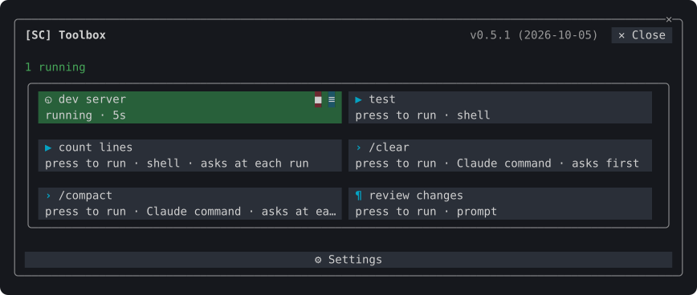

# SimpleCORE Claude Mods


Plugins for [Claude Code](https://code.claude.com) that add panes, a status band and slash commands to the terminal: switch between several Claude accounts, watch their usage limits and token use, see and clean up what Claude Code keeps on the machine, and keep agents, worktrees, checkpoints, diffs and memory files in one pane, and run a project's builds and commands from buttons. Install one plugin, `sc`, and you get them all.

## What's inside

### [Accounts](docs/accounts.md) · `/sc:accounts`


- Keep several Claude logins and switch every running session to another in one step.
- See each account's five-hour, weekly and per-model usage, with reset times, and what it spent past its plan when Claude reports it.
- **Usage**: the tokens used on this machine by day, model and project, counted from Claude Code's transcripts.
- **Storage**: what `~/.claude` holds by kind and project, and a cleanup of idle sessions confirmed by typing a word.
- A status band above the prompt: account, model and effort, task, context and usage, branch and PR, lines changed. Press the account's name to open the accounts pane, or the branch or the lines changed to open the workspace.
- An optional [webhook](docs/accounts.md#webhook) sends the status to an external system. It is off by default; leave it off if you have nothing to send to.

### [Workspace](docs/workspace.md) · `/sc:workspace`


- **Agents**: the session's subagents, what each did last and the answers of those that finished, and the repository's worktrees; stop an agent, open a worktree's changes, remove a merged one.
- **Checkpoints**: a snapshot of the working tree before every prompt; compare with one, see one turn's changes, name and pin one, or restore it.
- **Notes**: numbered notes kept per project, optionally sent to Claude with every prompt; Claude can mark one done for you to confirm.
- **Diff**: the files changed since the session started or since a checkpoint, up to now or a later checkpoint; each file's diff, restoring one file, and a request for a commit message.
- **Memory**: the memory files Claude Code reads, global and project apart, to read as Markdown and search line by line.

### [Toolbox](docs/toolbox.md) · `/sc:toolbox`



- The project's commands as buttons of one size, from **⚒ Toolbox** on the status band.
- Run and stop shell commands, and watch their log live in a dialog.
- Add tasks found in npm, Vite, Maven, Gradle, Cargo, make, just, Compose, Go and Python projects, or Claude's own commands such as `/clear` and `/compact`.
- Values fixed or asked at each run, with paths completed as you type.
- Kept in `.toolbox/toolbox.json` in the project; share it or ignore it in git. A skill lets Claude write it for you.

Anything that cannot be taken back asks in a dialog first; Esc cancels.

## Install

```bash
claude plugin marketplace add simplecore-inc/claude-mods
claude plugin install sc@simplecore-mods
```

`sc` installs `sc-accounts`, `sc-workspace` and `sc-toolbox` with it. The plugins are installed for your user, so they run in every session. Run `/reload-plugins` in a session that was already open.

To use a local clone instead, add its folder as the marketplace:

```bash
git clone https://github.com/simplecore-inc/claude-mods.git
claude plugin marketplace add ./claude-mods
claude plugin install sc@simplecore-mods
```

## Update

```bash
claude plugin marketplace update simplecore-mods
claude plugin update sc@simplecore-mods
claude plugin update sc-accounts@simplecore-mods
claude plugin update sc-workspace@simplecore-mods
claude plugin update sc-toolbox@simplecore-mods
```

Then run `/reload-plugins` in each open session. With a local clone, `git pull` in the clone and `/reload-plugins` are enough: a plugin from a folder marketplace is read from that folder.

## Uninstall

```bash
claude plugin uninstall sc@simplecore-mods
claude plugin prune
claude plugin marketplace remove simplecore-mods
```

`prune` removes `sc-accounts`, `sc-workspace` and `sc-toolbox`, which were installed as dependencies of `sc`; uninstall them by name instead if you installed them yourself. `marketplace remove` is only needed when you will not install from it again.

The mods leave some data behind, which you can delete by hand:

| What | Where |
| --- | --- |
| Saved logins | macOS: keychain items of the service `account-switch`. Elsewhere: `~/.claude/account-switch/` |
| Webhook token | macOS: the keychain item of the service `sc-webhook`. Elsewhere: `~/.claude/sc-accounts/webhook-token` |
| Webhook template | `~/.claude/sc-accounts/` |
| Settings, account index, notes, checkpoint lists | `~/.claude/plugins/store/sc-*.json` |
| Tools, their logs and remembered values | in each project: `.toolbox/` |
| Checkpoints | in each repository: the refs under `refs/sc/` and the files `.git/sc-snapshot-*.index` |

`~/.claude` is `CLAUDE_CONFIG_DIR` when that is set. To delete a repository's checkpoints:

```bash
git for-each-ref --format='%(refname)' refs/sc/ | xargs -n 1 git update-ref -d
rm -f "$(git rev-parse --git-dir)"/sc-snapshot-*.index
```

The account you are logged in with stays logged in; only the saved copies go.

## Language

The mods show English, and Korean where Claude Code's `language` setting is Korean; any other language falls back to English. Without that setting, `LC_ALL`, `LC_MESSAGES` and `LANG` decide, in that order.

## Developing

[Developing a mod](docs/developing.md) covers the layout, the rules the engine enforces, the checks and how to release.

## License

[MIT](LICENSE)
