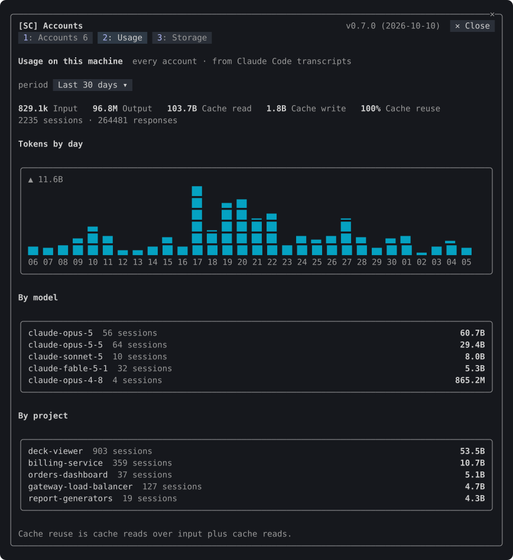
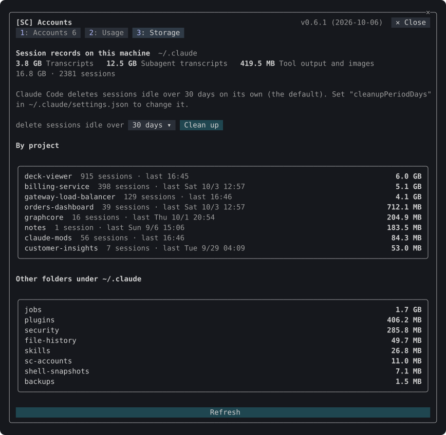

# Accounts

Plugin `sc-accounts`, folder `mods/accounts`. [Back to the overview](../README.md)

> [!IMPORTANT]
> Clicks reach this plugin only in Claude Code's fullscreen mode (`/tui fullscreen`). In the default mode, use the keyboard: `ctrl+x` `Tab`, then `Tab` and `Enter`. See [Clicking and the keyboard](../README.md#clicking-and-the-keyboard).

Keeps several Claude logins on this machine and switches every running session to any of them in one step. It shows each account's five-hour, weekly and per-model usage, and puts the session's status in a band above the prompt.


## Commands

| Command | What it does |
| --- | --- |
| `/sc:accounts`, `/sc:accounts accounts` | Opens the pane on its Accounts tab |
| `/sc:accounts list` | Prints every account with its limits and reset times |
| `/sc:accounts use <n\|email>` | Switches to an account by its number in the list, its email, or a prefix only one email starts with |
| `/sc:accounts remove <email>` | Removes a saved account named whole, by its email in any case or its account id; the account in use cannot be removed |
| `/sc:accounts refresh` | Looks up every account's limits now, past the automatic schedule |
| `/sc:accounts add` | Explains how to add an account |
| `/sc:accounts band on\|off` | Shows or hides the status band |
| `/sc:accounts usage` | Opens the pane on its Usage tab |
| `/sc:accounts storage` | Opens the pane on its Storage tab |
| `/sc:accounts webhook` | Opens the webhook settings (optional, see [Webhook](#webhook)) |

## Adding and switching accounts

1. The account you are logged in with is saved when the mod starts.
2. Log in to another account with `/login`. Within a minute the mod saves it as well.
3. Press **Switch** on its card and confirm in the dialog, or run `/sc:accounts use`. Every running Claude Code session on the machine uses it from its next request; nothing is restarted and no login is repeated. The dialog, like the one that removes an account, holds the keyboard on **Cancel** first, so an Enter meant for the prompt never switches the login.

   Every change of the login is recorded, one JSON line each, in `~/.claude/sc-accounts/login-changes.jsonl`: each switch (`switch`) with the time, the session's folder, the version, whether the dialog or the command asked for it and what it did about Orca; each change Orca made (`orca`); each Orca selection sc-accounts asked for (`follow`); and each change made by neither (`outside`). A change is explained once the login has stood still for ten seconds, in a toast as well, so a login that changed by itself is noticed at once, and a write that passes through another login on its way back says nothing.

   A window opened before the switch takes it up too: Claude Code reads the stored login again before it refreshes a token, so that window refreshes the new login instead of writing back the old one. When the login Claude Code holds is rejected outright, as a token already spent elsewhere is (the profile endpoint answers 401 or 403, or the token is empty), and the account `~/.claude.json` names has a saved login that works without a refresh, sc-accounts puts that saved login back, records it as `heal` and says so in a toast. A saved login that needs refreshing first is left to `/login`, as several sessions refreshing it at once would spend it too.

### With Orca

[Orca](https://www.onorca.dev) can keep Claude logins of its own. While one is selected there, Orca writes it into Claude Code's login each time it launches Claude, fetches the rate limits or starts, which puts back any login changed elsewhere. sc-accounts works with it, and without it:

| Orca | A switch | A login changed elsewhere |
| --- | --- | --- |
| Not installed | is made here | is taken up and said |
| Running, leaving Claude's login alone (no account selected) | is made here | is taken up and said |
| Running, with an account selected | is made here and the account selected in Orca too; an account Orca holds no login for is refused, with how to add it, as Orca would put its own back | made in Orca: said as Orca's. Made outside both (a `/login` in another terminal) to an account Orca keeps: selected in Orca too, so Orca keeps it; to one it does not keep: said, with the account Orca will put back |
| Installed, not running | is made here, and the account selected in Orca once it answers again, so the login Orca writes on starting is replaced within a minute | is taken up and said |

The switch dialog says when Orca is switched too. sc-accounts reaches Orca where its running app says in `orca-runtime.json` (in `~/Library/Application Support/orca` on macOS, `$XDG_CONFIG_HOME/orca` or `~/.config/orca` on Linux, `%APPDATA%\orca` on Windows, or `ORCA_USER_DATA_PATH`), as Orca's own CLI does: its Unix socket through `perl`, which macOS and Linux carry, and its named pipe on Windows through PowerShell.

An inactive account Orca keeps a login for is never refreshed here: its refresh token is the one Orca's copy holds, and refreshing it would leave Orca writing a spent login later. Once its access token has expired, its card keeps the last figures and says they are looked up again when the account is next in use.

Removing an account (`✕`) asks in a dialog first. Remove (or Enter) deletes its saved credential: the keychain item on macOS, the vault file elsewhere. Using it again takes a new `/login`. Esc or Cancel closes the dialog.

## The accounts pane

The pane has the tabs **Accounts**, **Usage** and **Storage**; a digit switches them.

### Accounts

- One card per account, the account in use outlined and marked **active**.
- A usage bar for each window, and under it the reset time in local time with the time left, such as `↻ 17:00(3h 05m)` today, or `↻ Wed 10/7 11:00(2d 20h)` on another day. Windows that reset together, such as the weekly limit and a model's weekly limit, share one cell and one reset line. In a weekly window's last three days its labels and reset line turn yellow, then orange the day before, then red on the day it resets, counted in local calendar days; the five-hour window stays as it is.
- Beside each email, how long ago its figures were looked up, to the minute, such as `(updated 12m ago)`. Under a minute it shows nothing.
- `◷` beside an account: its last lookup was rate limited, so the figures are the previous reading's. It clears on the next successful lookup.
- `Spent past the plan: 12.34 USD of 50.00 USD`: what the account spent beyond its plan, exactly as Claude's usage lookup reports it for that account. It shows only when spending past the plan is on or something was spent; nothing is estimated.
- The footer: **Refresh**, **Add account** and **Webhook**. **✕ Close** is at the right of the header, the first row of the pane.
### Usage



Tokens used on this machine, every account together, counted from Claude Code's session transcripts, subagents' included:

- The period: the last 7 or 30 days, or everything counted.
- Input, output, cache read and cache write tokens, the cache reuse (cache reads over input plus cache reads), and the sessions and responses.
- Tokens by day, as bars, and the top models and projects with their sessions.

The first count reads every transcript and takes a few minutes for gigabytes of them; the tab says how far it has got, and a count stopped by closing the tab goes on where it stopped. After that only what the transcripts gained is read. The counts are kept in `~/.claude/sc-accounts/usage-index.json`. Counting needs a POSIX shell (`sh`, `head`, `tail`, `awk`); on Windows only Git Bash or WSL has one.

### Storage



What Claude Code keeps under `~/.claude`:

- Session transcripts, subagent transcripts, and tool output and images, with their sizes.
- Each project folder: its sessions, size and last activity.
- The other folders under `~/.claude` of a megabyte or more.
- Claude Code's own cleanup: it deletes sessions idle longer than `cleanupPeriodDays` (30 days unless set in `~/.claude/settings.json`).

**Clean up** deletes every session idle longer than the age picked (7, 14, 30 or 90 days): its transcript, its subagents' transcripts and its tool output. The dialog names how many sessions and how much space and deletes only when `delete` is typed in it; what it deletes then is the sessions it named that are still idle. The session running here is never deleted, nor one a running Claude Code process names with `--resume`, `-r` or `--session-id`, however long it has been idle. Every transcript is counted for the Usage tab first, so the usage figures keep their tokens. A deleted session can no longer be resumed.

### The header

- The header names the pane, `[SC] Accounts`, and shows the version and release date. With the workspace pane open too, Claude Code shows the two as tabs, `Accounts` and `Workspace`, and the header stays, a row below the tabs.

## The status band


A band above the prompt, under a dim rule. It stays on one line and wraps only when the terminal is too narrow:

- the live account
- the model, effort (or ULTRACODE) and fast mode
- the current task
- the session's context gauge, and five-hour and weekly usage; the weekly label and its reset turn yellow three days before the reset, orange the day before and red on the day
- the directory, branch and PR
- the lines added and removed, on a filled block

Some cells open a pane when pressed, and pressing again closes it:

| Cell | Opens |
| --- | --- |
| The account's name | the accounts pane |
| The directory and branch, or the lines changed | the workspace, on its Diff tab |
| ⚒ Toolbox | the [toolbox](toolbox.md) buttons, when `sc-toolbox` is installed; the cell says what its tools are doing (`· 1 running`, `· 1 failed`) |

A pane opened this way shows at any terminal width. A pressed cell keeps its colours under the pointer.

### Where the status comes from

The mod reads the status itself, so no status line command is needed, and the row Claude Code keeps under the prompt for one is not drawn.

| Field | Read from |
| --- | --- |
| Model | the session's model |
| Effort | the effort of each main-loop request; before the first, the model's `effortLevel` in `modelSettings`, else `effortLevel` |
| Fast mode | the `fastMode` setting |
| ULTRACODE | the session's transcript, where each switch is recorded; only what was appended since the last read is scanned. It needs a POSIX shell (`sh`, `head`, `tail`, `grep`, `awk`), which Windows has only with Git Bash or WSL; without one, ULTRACODE is not shown |
| Task | the in-progress item of the session's newest todo list (`todos/` under Claude Code's config directory) |
| Directory and branch | the session's working directory and `git branch --show-current` |
| PR | `gh pr view` for the branch, at most every three minutes; nothing without `gh` |
| Context | the session's context reading |
| Lines added and removed | each Edit, MultiEdit, Write and NotebookEdit call: the file before and after, compared line by line |

## Settings

| Setting | Default | Where |
| --- | --- | --- |
| `showStatusBand` | on | `/config`, or `/sc:accounts band on\|off` |

With `showStatusBand` off, Claude Code draws the band area as it does without the mod. Everything else keeps working.

## Webhook

The webhook connects the mod to an external system, such as a team dashboard or a monitoring service, by sending the session's status to a URL you choose. **It is optional and off by default: if you have nothing to send the status to, leave it off and ignore this section.** Nothing is sent while it is off.

### When it sends

While it is on, the status is sent when it changes (the model, effort, context, usage, branch, lines changed and the rest), and every 30 seconds while nothing changes. It is never sent twice within two seconds.

### Setting it up

Press **Webhook** in the accounts pane, or run `/sc:accounts webhook`.


The dialog has:

- **Send the status**: on or off.
- **Method**: POST sends the filled template as a JSON body. GET sends its top-level fields as query parameters, an object or array as JSON text.
- **URL**: an absolute `http` or `https` URL.
- **Bearer token** (optional): sent as `Authorization: Bearer <token>`. It is kept in the keychain (service `sc-webhook`) on macOS and in an owner-only file elsewhere, and is never shown.
- **Template**: the path of the template file, the variables it may use (the times grouped by format, each format with an example), and what it would send now.
- **Send a test**: sends once and shows the HTTP status, with the start of what the receiver answered under it. **Save** keeps the settings for every session on the machine.

The dialog's last line is the last send, test or feed: its HTTP status, or why it failed, and under it the start of the receiver's answer, as a receiver can answer HTTP 200 and still say it stored nothing. A receiver that does not answer within 10 seconds is said not to have answered. The feed sends one request at a time and lets an unanswered one go after five minutes; the status keeps updating meanwhile.

### The template

What is sent comes from the file `~/.claude/sc-accounts/webhook.json` (under `CLAUDE_CONFIG_DIR` when set). The dialog writes it from the default when it is missing. Edit it in any editor; each send reads it again and never writes it. A file still holding, byte for byte, a default an earlier release wrote is replaced with the current default when a session starts or the dialog opens; a file you edited is left as it is.

The template is JSON. A string that is one placeholder alone, such as `"{{context}}"`, becomes that value as JSON: a number stays a number, and a missing value is `null`. A placeholder inside a longer string, such as `"{{account}} on {{hostname}}"`, is put in as text.

```json
{
  "session": "{{session}}",
  "model": "{{model}}",
  "context": "{{context}}",
  "where": "{{dir}} on {{hostname}}"
}
```

| Variable | Value |
| --- | --- |
| `session` | the session id |
| `hostname`, `version` | the machine's name and Claude Code's version |
| `cwd`, `dir`, `branch` | the working directory, its last segment and the branch |
| `model`, `modelId` | the model as shown and its id |
| `effort`, `fast`, `ultracode` | the effort level, fast mode and ULTRACODE |
| `context`, `cost` | context used in percent, and the session's cost in USD |
| `linesAdded`, `linesRemoved` | lines changed by file-editing tools this session |
| `task`, `pr`, `prReview` | the in-progress task, the PR number and its review decision |
| `account` | the live account's email |
| `fiveHour`, `weekly` | the live account's five-hour and weekly usage in percent |

Each time comes in every format below. `time…` is now; `fiveHourResetsAt…` and `weeklyResetsAt…` are when the live account's five-hour and weekly windows reset, and `null` in every format when there is no such window. The dialog lists them the same way, each format with the time now as its example.

| Variables | Format | Example |
| --- | --- | --- |
| `time`, `fiveHourResetsAt`, `weeklyResetsAt` | ISO 8601 text in UTC | `"2026-10-06T09:20:00.000Z"` |
| `timeEpoch`, `fiveHourResetsAtEpoch`, `weeklyResetsAtEpoch` | Unix time in seconds, a number, as Claude Code's status line input gives reset times | `1791278400` |
| `timeEpochMs`, `fiveHourResetsAtEpochMs`, `weeklyResetsAtEpochMs` | Unix time in milliseconds, a number; `timestamp` is the same as `timeEpochMs` | `1791278400000` |
| `timeLocal`, `fiveHourResetsAtLocal`, `weeklyResetsAtLocal` | this computer's local time with its offset from UTC, text (RFC 3339) | `"2026-10-06T18:20:00+09:00"` |

The default template takes the shape of Claude Code's status line input (`session_id`, `model`, `context_window`, `cost`, `rate_limits` and the rest), its `resets_at` in Unix seconds as that input has them, so a receiver written for that input keeps working.

## How it works

- **Storage.** On macOS each saved account's OAuth credential is one keychain item under the service `account-switch`, keyed by account id; the secret travels to `security` on stdin as hex, never in a command line. On Linux, WSL and Windows, where Claude Code keeps its own login in `~/.claude/.credentials.json`, each saved credential is `~/.claude/account-switch/<account id>.json` (`CLAUDE_CONFIG_DIR` replaces `~/.claude`). On Linux and WSL it is written owner-only (mode 600) through stdin, and a file already there is narrowed to 600 before the write; on Windows it inherits the profile directory's access list. Only the account details that hold no secret (the `oauthAccount` value of `~/.claude.json`) are kept in the plugin store.
- **Switching.** On macOS the chosen credential is written to the keychain item Claude Code reads, named as Claude Code names it (`Claude Code-credentials`, with `-` and eight hex digits of a SHA-256 of the folder when `CLAUDE_CONFIG_DIR` or `CLAUDE_SECURESTORAGE_CONFIG_DIR` is set, under the user's name as its account), and to `.credentials.json` when that file exists; elsewhere it is written to `.credentials.json`. `oauthAccount` in `~/.claude.json` is set to the account's details. Each write takes Claude Code's own lock first (`.storage-write.lock` beside `.credentials.json` for the login, `~/.claude.json.lock` for the config), and each file is replaced whole through a temporary file beside it, so Claude Code never reads half a write; `~/.claude.json` is read again under its lock and only `oauthAccount` changes. A switch whose write fails puts back the login that was there, and the record marks it `failed`. Claude Code compares the modification time of `.credentials.json` before it uses a token, so a running session picks up the new login from its next request. Where the file does not exist, the change lands once Claude Code's keychain cache expires (30 seconds).
- **Telling accounts apart.** When the login changes, the mod asks the profile endpoint whose token it is before filing it, so a token is never saved under the wrong account. A login older than the one saved for its account (another refresh token that expires sooner) is used but never filed over it, so a window writing back an old login never replaces a newer one. Each account's usage is looked up with that account's own token.
- **Usage lookups.** The automatic lookup runs once every five minutes across the machine, and every running session shares its result. A 429 pauses automatic lookups for `Retry-After`, or without it for five minutes doubling up to an hour. **Refresh** and `/sc:accounts refresh` always look up at once. The usage and profile lookups wait at most 15 seconds; past that the card says which did not answer.
- **The live account.** Its figures are updated from every response Claude Code receives, and looked up every two minutes when there is none. A response to a turn that began before the account changed belongs to the previous account, so it prompts a lookup instead of being applied.
- **Token refresh.** When an inactive account's access token nears expiry, the mod refreshes it and saves the rotated refresh token, under a lock of that account's (`~/.claude/sc-accounts/locks/refresh-<account id>.lock`) and after reading the saved login again, so two sessions never spend one refresh token. A refresh that answers after its 30 seconds is still saved. The grant Claude Code holds (the same refresh token) is Claude Code's to refresh and is never refreshed here, even while the config names another account, nor is an account Orca keeps a login for (see [With Orca](#with-orca)). An account whose refresh is refused asks for a new login.

## Caveats

- The usage lookup (`/api/oauth/usage`), the profile lookup and the token refresh use endpoints with no public documentation, which may change without notice.
- One login is active per machine: switching moves every running Claude Code session to the chosen account.
- Orca's runtime endpoint and its `accounts.list` and `accounts.selectClaude` requests are Orca's own interface, with no public documentation, and may change. Reaching it needs `perl` on macOS and Linux and PowerShell on Windows; the Windows path, through Orca's named pipe, is untested.
