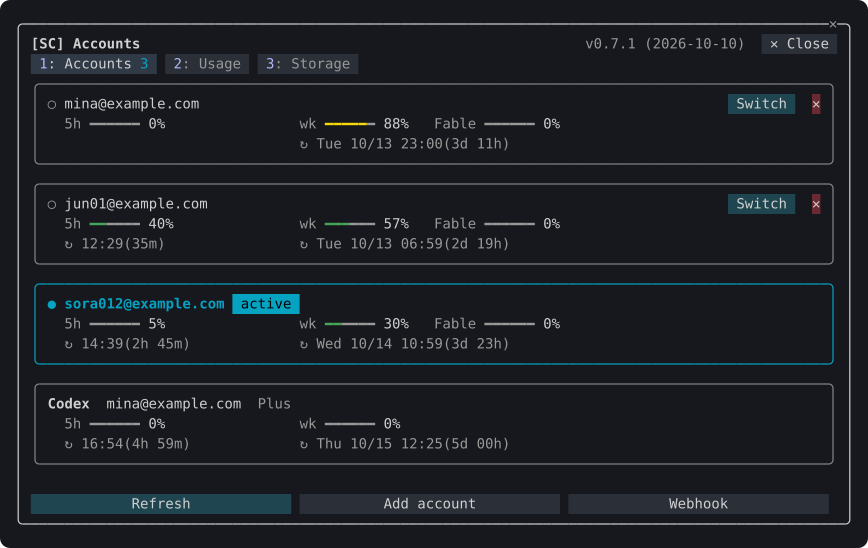
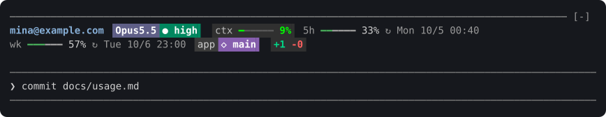
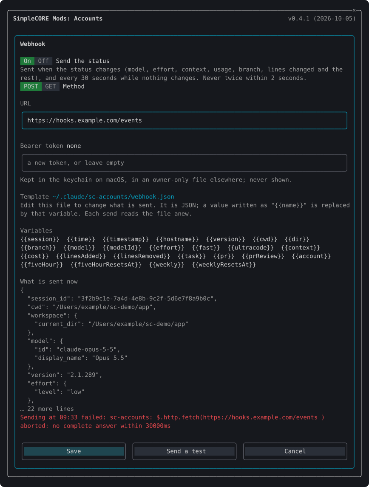

# Accounts

Plugin `sc-accounts`, folder `mods/accounts`. [Back to the overview](../README.md)

Keeps several Claude logins on this machine and switches every running session to any of them in one step. It shows each account's five-hour, weekly and per-model usage, and puts the session's status in a band above the prompt.



## Commands

| Command | What it does |
| --- | --- |
| `/sc:accounts` | Opens the accounts pane |
| `/sc:accounts list` | Prints every account with its limits and reset times |
| `/sc:accounts use <n\|email>` | Switches to an account by its number in the list, its email, or a prefix only one email starts with |
| `/sc:accounts remove <n\|email>` | Removes a saved account; the account in use cannot be removed |
| `/sc:accounts refresh` | Looks up every account's limits now, past the automatic schedule |
| `/sc:accounts add` | Explains how to add an account |
| `/sc:accounts band on\|off` | Shows or hides the status band |
| `/sc:accounts webhook` | Opens the webhook settings (optional, see [Webhook](#webhook)) |

## Adding and switching accounts

1. The account you are logged in with is saved when the mod starts.
2. Log in to another account with `/login`. Within a minute the mod saves it as well.
3. Press **Switch** on its card, or run `/sc:accounts use`. Every running Claude Code session on the machine uses it from its next request; nothing is restarted and no login is repeated.

Removing an account (`✕`) asks in a dialog first. Remove (or Enter) deletes its saved credential: the keychain item on macOS, the vault file elsewhere. Using it again takes a new `/login`. Esc or Cancel closes the dialog.

## The accounts pane

- One card per account, the account in use outlined and marked **active**.
- A usage bar for each window, and under it the reset time in local time with the time left, such as `↻ 17:00(3h 05m)` today, or `↻ Wed 10/7 11:00(2d 20h)` on another day. Windows that reset together, such as the weekly limit and a model's weekly limit, share one cell and one reset line.
- Beside each email, how long ago its figures were looked up, to the minute, such as `(updated 12m ago)`. Under a minute it shows nothing.
- `◷` beside an account: its last lookup was rate limited, so the figures are the previous reading's. It clears on the next successful lookup.
- The footer: **Refresh**, **Add account**, **Webhook** and **Close**.
- The header names the pane, `SimpleCORE Mods: Accounts`, and shows the version and release date. With the workspace pane open too, Claude Code shows the two as tabs, `SC-Accounts` and `SC-Workspace`, and the header stays, a row below the tabs.

## The status band



A band above the prompt, under a dim rule. It stays on one line and wraps only when the terminal is too narrow:

- the live account
- the model, effort (or ULTRACODE) and fast mode
- the current task
- the session's context gauge, and five-hour and weekly usage
- the directory, branch and PR
- the lines added and removed, on a filled block

Some cells open a pane when pressed, and pressing again closes it:

| Cell | Opens |
| --- | --- |
| The account's name | the accounts pane |
| The directory and branch, or the lines changed | the workspace, on its Diff tab |

A pane opened this way shows at any terminal width. A pressed cell keeps its colours under the pointer.

### Where the status comes from

The mod reads the status itself, so no status line command is needed, and the row Claude Code keeps under the prompt for one is not drawn.

| Field | Read from |
| --- | --- |
| Model | the session's model |
| Effort | the effort of each main-loop request; before the first, the model's `effortLevel` in `modelSettings`, else `effortLevel` |
| Fast mode | the `fastMode` setting |
| ULTRACODE | the session's transcript, where each switch is recorded; only what was appended since the last read is scanned. It needs a POSIX shell (`sh`, `head`, `tail`, `grep`, `awk`), which Windows has only with Git Bash or WSL; without one, ULTRACODE is not shown |
| Task | the in-progress item of the session's newest todo list (`todos/` under Claude Code's config directory) |
| Directory and branch | the session's working directory and `git branch --show-current` |
| PR | `gh pr view` for the branch, at most every three minutes; nothing without `gh` |
| Context | the session's context reading |
| Lines added and removed | each Edit, MultiEdit, Write and NotebookEdit call: the file before and after, compared line by line |

## Settings

| Setting | Default | Where |
| --- | --- | --- |
| `showStatusBand` | on | `/config`, or `/sc:accounts band on\|off` |

With `showStatusBand` off, Claude Code draws the band area as it does without the mod. Everything else keeps working.

## Webhook

The webhook connects the mod to an external system, such as a team dashboard or a monitoring service, by sending the session's status to a URL you choose. **It is optional and off by default: if you have nothing to send the status to, leave it off and ignore this section.** Nothing is sent while it is off.

### When it sends

While it is on, the status is sent when it changes (the model, effort, context, usage, branch, lines changed and the rest), and every 30 seconds while nothing changes. It is never sent twice within two seconds.

### Setting it up

Press **Webhook** in the accounts pane, or run `/sc:accounts webhook`.



The dialog has:

- **Send the status**: on or off.
- **Method**: POST sends the filled template as a JSON body. GET sends its top-level fields as query parameters, an object or array as JSON text.
- **URL**: an absolute `http` or `https` URL.
- **Bearer token** (optional): sent as `Authorization: Bearer <token>`. It is kept in the keychain (service `sc-webhook`) on macOS and in an owner-only file elsewhere, and is never shown.
- **Template**: the path of the template file, the variables it may use, and what it would send now.
- **Send a test**: sends once and shows the response. **Save** keeps the settings for every session on the machine.

A receiver that does not answer holds one send at a time; the status keeps updating meanwhile, and the dialog shows why the last send failed.

### The template

What is sent comes from the file `~/.claude/sc-accounts/webhook.json` (under `CLAUDE_CONFIG_DIR` when set). The dialog writes it from the default the first time it opens. Edit it in any editor; each send reads it again.

The template is JSON. A string that is one placeholder alone, such as `"{{context}}"`, becomes that value as JSON: a number stays a number, and a missing value is `null`. A placeholder inside a longer string, such as `"{{account}} on {{hostname}}"`, is put in as text.

```json
{
  "session": "{{session}}",
  "model": "{{model}}",
  "context": "{{context}}",
  "where": "{{dir}} on {{hostname}}"
}
```

| Variable | Value |
| --- | --- |
| `session` | the session id |
| `time`, `timestamp` | now, as ISO 8601 and as milliseconds |
| `hostname`, `version` | the machine's name and Claude Code's version |
| `cwd`, `dir`, `branch` | the working directory, its last segment and the branch |
| `model`, `modelId` | the model as shown and its id |
| `effort`, `fast`, `ultracode` | the effort level, fast mode and ULTRACODE |
| `context`, `cost` | context used in percent, and the session's cost in USD |
| `linesAdded`, `linesRemoved` | lines changed by file-editing tools this session |
| `task`, `pr`, `prReview` | the in-progress task, the PR number and its review decision |
| `account` | the live account's email |
| `fiveHour`, `fiveHourResetsAt`, `weekly`, `weeklyResetsAt` | the live account's usage in percent and reset times |

The default template takes the shape of Claude Code's status line input (`session_id`, `model`, `context_window`, `cost`, `rate_limits` and the rest), so a receiver written for that input keeps working.

## How it works

- **Storage.** On macOS each saved account's OAuth credential is one keychain item under the service `account-switch`, keyed by account id; the secret travels to `security` on stdin as hex, never in a command line. On Linux, WSL and Windows, where Claude Code keeps its own login in `~/.claude/.credentials.json`, each saved credential is `~/.claude/account-switch/<account id>.json` (`CLAUDE_CONFIG_DIR` replaces `~/.claude`). On Linux and WSL it is written owner-only (mode 600) through stdin, and a file already there is narrowed to 600 before the write; on Windows it inherits the profile directory's access list. Only the account details that hold no secret (the `oauthAccount` value of `~/.claude.json`) are kept in the plugin store.
- **Switching.** On macOS the chosen credential is written to the keychain item Claude Code reads (`Claude Code-credentials`), and to `~/.claude/.credentials.json` when that file exists; elsewhere it is written to `.credentials.json`. `oauthAccount` in `~/.claude.json` is set to the account's details. Claude Code compares the modification time of `.credentials.json` before it uses a token, so a running session picks up the new login from its next request. Where the file does not exist, the change lands once Claude Code's keychain cache expires (30 seconds).
- **Telling accounts apart.** When the login changes, the mod asks the profile endpoint whose token it is before filing it, so a token is never saved under the wrong account. Each account's usage is looked up with that account's own token.
- **Usage lookups.** The automatic lookup runs once every five minutes across the machine, and every running session shares its result. A 429 pauses automatic lookups for `Retry-After`, or without it for five minutes doubling up to an hour. **Refresh** and `/sc:accounts refresh` always look up at once.
- **The live account.** Its figures are updated from every response Claude Code receives, and looked up every two minutes when there is none. A response to a turn that began before the account changed belongs to the previous account, so it prompts a lookup instead of being applied.
- **Token refresh.** When an inactive account's access token nears expiry, the mod refreshes it and saves the rotated refresh token. The live account's token is Claude Code's to refresh and is never touched. An account whose refresh is refused asks for a new login.

## Caveats

- The usage lookup (`/api/oauth/usage`), the profile lookup and the token refresh use endpoints with no public documentation, which may change without notice.
- One login is active per machine: switching moves every running Claude Code session to the chosen account.
