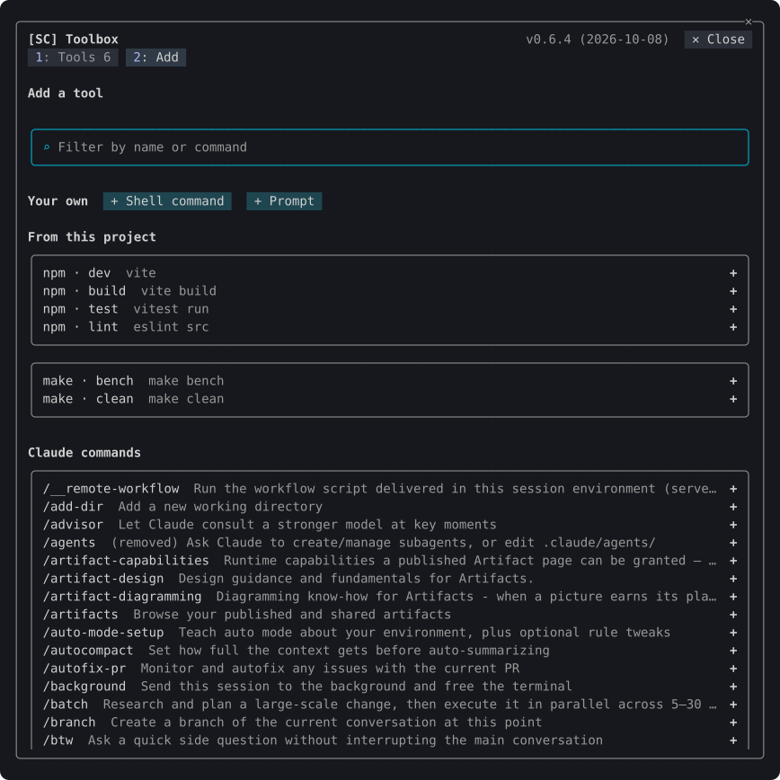
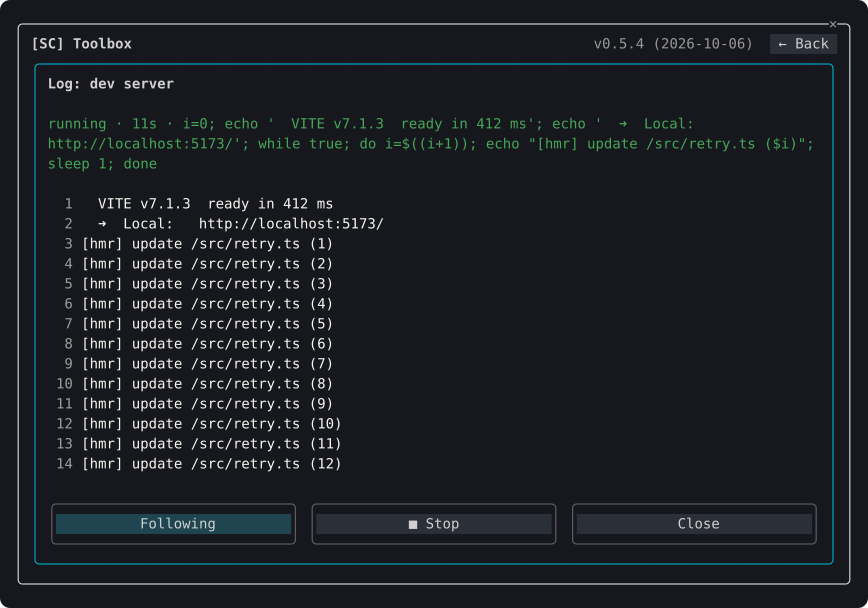

# Toolbox

Plugin `sc-toolbox`, folder `mods/toolbox`. [Back to the overview](../README.md)

Runs the commands a project needs often (a build, a dev server, a test run, a Claude command or a prompt) from buttons, and stops them. Press **⚒ Toolbox** on the [status band](accounts.md#the-status-band) or run `/sc:toolbox` to show the tools as buttons of one size; **⚙ Settings** opens the pane where tools are added and edited.


## Commands

| Command | What it does |
| --- | --- |
| `/sc:toolbox` | Shows the tool buttons |
| `/sc:toolbox tools` | Opens the settings pane on the Tools tab |
| `/sc:toolbox add` | Opens the settings pane on the Add tab |

## Where the tools are kept

The tools live in the project, in `.toolbox/toolbox.json`. Whether they are shared is your choice: commit the file to share it, or add `.toolbox/` to the project's `.gitignore` to keep it to yourself. The toolbox writes its own `.toolbox/.gitignore` the first time, keeping out `logs/` (the output of each run) and `state.json` (the values last typed); delete a line there to share that too.

The plugin ships the `toolbox` skill, so Claude can write or change `toolbox.json` when asked ("add a tool that runs the tests for one module").

## Kinds of tool

| Kind | When run |
| --- | --- |
| Shell | Runs the command in the project's folder, or in `cwd` under it. Its output goes to a log; `■` stops it with everything it started. |
| Claude | Runs a slash command such as `/clear` or `/compact`. It waits until Claude has finished answering. |
| Prompt | Puts the text in the prompt box. Set **When run** to **Send it at once** to send it instead. |

## The buttons

A line above the tiles says what runs, waits and failed (`1 running · 1 failed`), or, when nothing does, how the tiles work. Each tool is a tile of two lines, two to a row, in a box apart from **⚙ Settings**; **✕ Close** is at the right of the header. A tile says how its tool stands in words and colour:

| State | Icon | Tile |
| --- | --- | --- |
| Not run yet | `▶` shell, `›` Claude command, `¶` prompt | `press to run`, its kind, and whether it asks first or asks for values |
| Running | a circle filling by quarters (`○ ◔ ◑ ◕ ●`) when the output says how far it has got (`45%`, `[3/10]`), else a turning circle, blinking | green, with the time it has run and the share done; `■` stops it |
| Waiting for Claude | `◌`, blinking | yellow, blinking |
| Done, stopped | `✔`, `■` | how long it took and how long ago |
| Failed | `✖` | red, with the exit code, how long it took and how long ago |

Pressing anywhere on a tile runs a tool not yet run, a Claude command or a prompt. A shell tool that has run opens its log instead, so looking at a result never runs it again; `▶` on its tile, or **▶ Run again** in its log, runs it again.

When a shell tool finishes or fails, a toast says so, whether the toolbox is open or not.

## On the status band

The **⚒ Toolbox** cell on the [status band](accounts.md#the-status-band) says what the tools are doing: `⚒ Toolbox · 1 running` on green, `· 1 waiting` on yellow, `· 1 failed` on red. A failure counts until the toolbox is next opened.

## Asking before a run

**Before each run: Ask first** makes a tool ask "Run /clear?" before it runs, for a command that cannot be taken back. The dialog shows the command as it will run. Claude Code's `/clear`, `/reload-plugins`, `/exit`, `/logout` and `/rewind` are added from the list with it set. In `toolbox.json` it is `"confirm": true`.

## Values asked at each run

A command names a value as `{{name}}`. Each value is fixed or asked at every run; the dialog that asks shows the command as it will run, filled with what is typed. A value is text, a path or one of a list of choices. A path is completed as you type from the project's folders and files, optionally only those matching a pattern such as `*.ts`. A value asked is remembered for the next run.

In a shell command a value is quoted as one word, so a space or a quote in it is safe; `{{name|raw}}` puts it in as typed.

```json
{
  "version": 1,
  "tools": [
    { "id": "test-file", "name": "Test a file", "kind": "shell", "run": "npx vitest run {{file}}",
      "params": { "file": { "type": "path", "mode": "ask", "pathKind": "file", "glob": "*.test.ts" } } },
    { "id": "compact", "name": "/compact", "kind": "claude", "run": "/compact {{focus}}" }
  ]
}
```

## The settings pane



**Tools** lists the tools by kind, each with its command and the state of its last run. `▶` runs a tool, `■` stops it, `≡` opens its log, `✎` edits it and `✕` removes it.

**Add** offers what it finds, filtered by what you type:

- the tasks of the project's build files: npm (workspace packages included), Vite, Maven, Gradle, Cargo, make, just, Docker Compose, Go and Python. Gradle lists its common tasks; **Load every Gradle task** asks Gradle for all of them.
- Claude Code's commands, built-in ones first, then your own, plugins' and skills'.
- a shell command or a prompt of your own.

Pressing one opens it to edit before it is saved.

## The log



A shell tool's log opens in a dialog and follows the output as it arrives. **▲ Older** and **▼ Newer** page through it, **Follow** goes back to the newest line, **■ Stop** ends the run, and once it has ended **▶ Run again** starts it again. A log left from an earlier session opens from its file. Every line is also written to `.toolbox/logs/<id>.log`, which keeps the last 3 MB.
