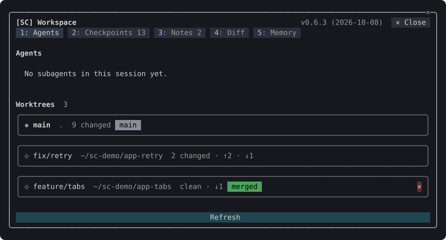
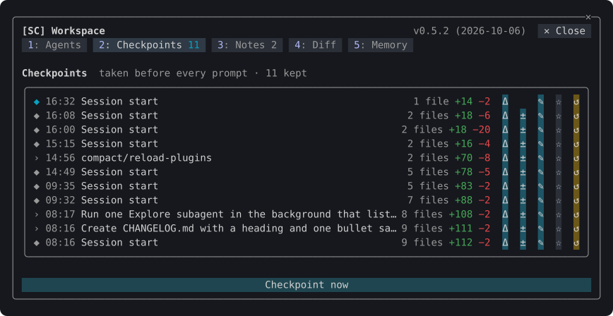
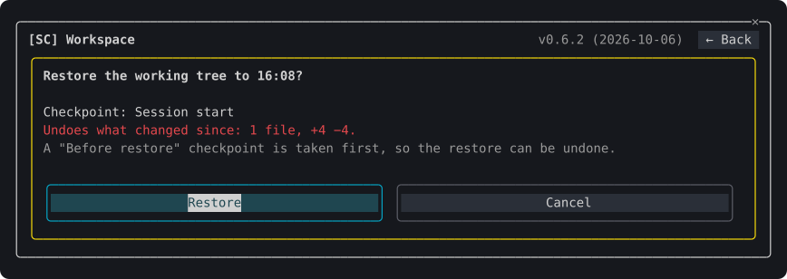
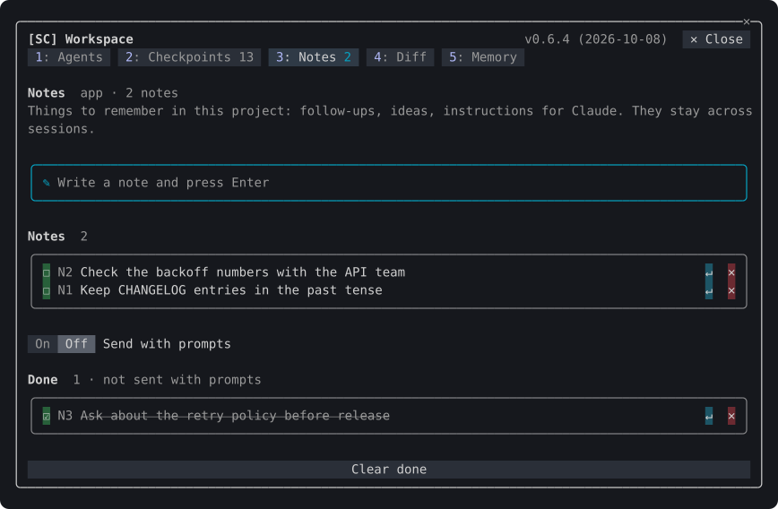
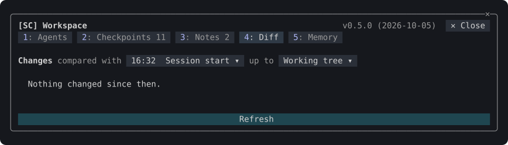
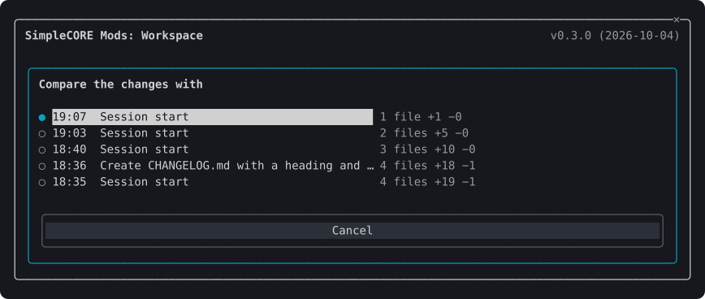

# Workspace

Plugin `sc-workspace`, folder `mods/workspace`. [Back to the overview](../README.md)

One pane with four tabs for what goes on in the session: its agents and the repository's worktrees, checkpoints of the working tree, notes, and the changes made. Open it with `/sc:workspace`, or by pressing the directory and branch or the lines changed on the [status band](accounts.md#the-status-band). A digit (1 to 4) switches tabs.

## Commands

| Command | What it does |
| --- | --- |
| `/sc:workspace` | Opens the pane on the tab last shown |
| `/sc:workspace agents\|checkpoints\|notes\|diff` | Opens the pane on that tab |
| `/sc:workspace notes <text>` | Adds a note and opens the Notes tab |
| `/sc:workspace toggle [tab]` | Closes the pane when it is open, else opens it, on that tab when one is named |

## Tabs

### Agents

The session's subagents and teammates: a coloured mark for the status (running `●`, waiting `◐`, done `✔`, failed `✖`), the type, and how long ago it started. A running one can be stopped (`■`).

Below are the repository's worktrees: branch, path, changed files, and commits ahead (`↑`) and behind (`↓`) the main branch. A worktree that is clean and merged is marked `merged` and can be removed (`✕`), its branch with it.

### Checkpoints

A snapshot of the working tree is taken before every prompt, and when the session starts. Each row shows when it was taken, the prompt it came before, and what changed since: files, lines added and removed.

- `Δ` opens the Diff tab against that checkpoint.
- `↺` restores it, after a dialog that names the checkpoint and what restoring would undo. A "Before restore" checkpoint is taken first, so the restore can be undone.

  

- **Checkpoint now** takes one at once.

### Notes

A scratchpad for what to remember in this project: follow-ups, ideas, instructions for Claude. Notes stay with the project across sessions.

- Write one in the bordered field (`✎`) and press Enter, or run `/sc:workspace notes <text>`.
- `↵` puts a note in the prompt.
- With **Send with prompts** on (the `notesInContext` setting, switched from the tab), Claude gets the open notes with every prompt.
- `☐` marks a note done: it moves to the Done group, struck through, and is no longer sent. `✕` deletes it.

### Diff

The files changed since the session started, or since a checkpoint. The base is named in the tab's header, such as `compared with 17:07  Session start ▾`. Pressing it opens a dialog listing the newest 12 checkpoints and the session's start, each with what changed since it, the one in use marked `●`. `Δ` on the Checkpoints tab chooses one too.

Each file shows a status letter (A, M, D, R), its name with the folder dimmed beside it, a bar of lines added and removed, and the counts. Pressing a file shows its diff below. A long diff shows its first 9,500 characters, and a line over 400 characters is cut with `…`; the rest is counted below it.

## The pane's name

The header names the pane, `SimpleCORE Mods: Workspace`. With the accounts pane open too, Claude Code shows the two as tabs, `SC-Workspace` and `SC-Accounts`, and the header stays, a row below the tabs.

## Dialogs

Every action that cannot be taken back (restoring a checkpoint, deleting a note, stopping an agent, removing a worktree) asks first in a dialog inside the pane, which names what it acts on. The confirm button (or Enter) carries it out; Esc or Cancel closes the dialog and nothing changes.

## Settings

| Setting | Default | What it does |
| --- | --- | --- |
| `checkpointEveryPrompt` | on | Takes a checkpoint before every prompt |
| `notesInContext` | off | Hands the project's open notes to the model with every prompt |

## How it works

- **Checkpoints are git objects.** A snapshot is built in an index of the session's own (`GIT_INDEX_FILE` set to `.git/sc-snapshot-<session>.index`), with tracked and untracked files and ignored ones left out, then kept as a commit under `refs/sc/checkpoints/<session>/<n>`. The index is kept between snapshots, so a snapshot rehashes only the files that changed, and it is deleted when the session ends. Two sessions in one repository never share an index lock. Your staging area, branches and stash are never touched. The newest 50 checkpoints per project are kept; older ones lose their refs.
- **Restoring** writes back every file the checkpoint holds (`git restore --source`) and removes the files made since it. Ignored files are left alone.
- **Live updates.** The Checkpoints, Diff and Notes tabs catch up 1.5 seconds after a file-changing tool call (Edit, Write, MultiEdit, NotebookEdit, Bash, a subagent's included) settles, and every five seconds while the pane is open, so edits made in an editor show too. Nothing is computed while the pane is closed, and nothing is redrawn when nothing changed. Notes are re-read from the store, so a note another session wrote shows here as well.
- **Agents** come from Claude Code's own list of the session's agents, read every three seconds. Stopping one calls Claude Code's `TaskStop` tool, with its usual permission check.
- **Worktrees** come from `git worktree list`. A worktree is removed with `git worktree remove` (never forced) and its branch with `git branch -d`, which refuses an unmerged branch.
- Outside a git repository the Agents tab still lists agents; the other tabs say that they need a repository.

## Caveats

- A checkpoint holds every untracked file that is not ignored, secrets in an unignored `.env` included. Its refs live under `refs/sc/`, which a normal `git push` leaves behind and `git push --mirror` sends.
- Restoring removes the files made since a checkpoint with `rm`, or with PowerShell's `Remove-Item` on Windows.
