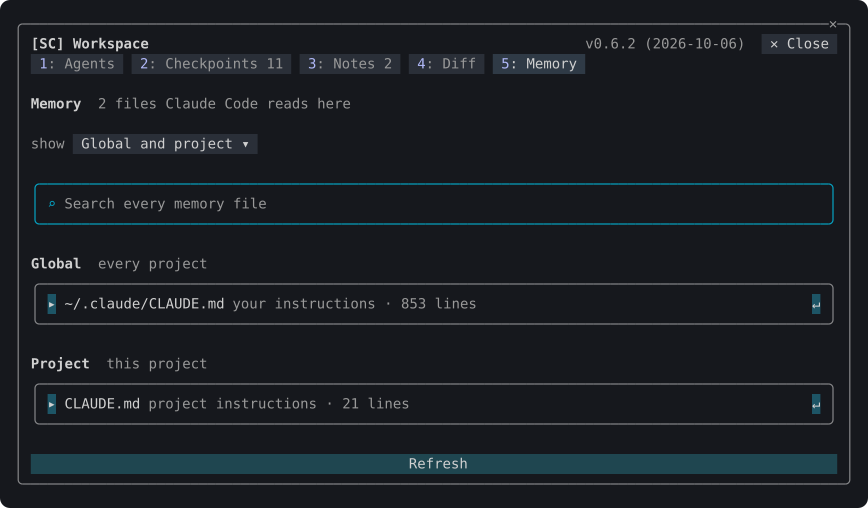
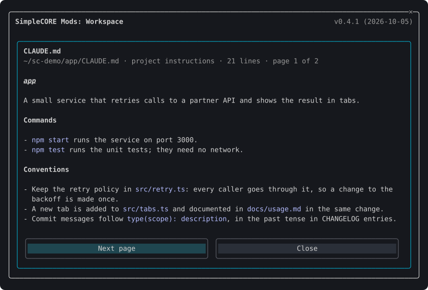

# Workspace

Plugin `sc-workspace`, folder `mods/workspace`. [Back to the overview](../README.md)

One pane with a tab for each part of the session: its agents and the repository's worktrees, checkpoints of the working tree, notes, the changes made, and the memory files Claude Code reads. Open it with `/sc:workspace`, or by pressing the directory and branch or the lines changed on the [status band](accounts.md#the-status-band). A digit (1 to 5) switches tabs.

## Commands

| Command | What it does |
| --- | --- |
| `/sc:workspace` | Opens the pane on the tab last shown |
| `/sc:workspace agents\|checkpoints\|notes\|diff\|memory` | Opens the pane on that tab |
| `/sc:workspace notes <text>` | Adds a note and opens the Notes tab |
| `/sc:workspace name <text>` | Names the newest checkpoint and pins it |
| `/sc:workspace toggle [tab]` | Closes the pane when it is open, else opens it, on that tab when one is named |

## Tabs

### Agents

The session's subagents and teammates: a coloured mark for the status (running `●`, waiting `◐`, done `✔`, failed `✖`), the type, and how long ago it started. A running one can be stopped (`■`).

Under each agent, a dim line says what it did last: the tool it called and what on (`↳ 2m ago · Bash: npm test`), or, once its turn has ended, the first line of its answer marked `✔`. The status is read again the moment a turn ends, so a row never shows `running` beside an answer.

Claude Code stops listing a finished agent within seconds. Such an agent moves to the **Finished** group for the rest of the session (the newest 20), and `▸` beside it shows its whole answer.

Below are the repository's worktrees: branch, path, changed files, and commits ahead (`↑`) and behind (`↓`) the main branch. A worktree that is clean and merged is marked `merged` and can be removed (`✕`), its branch with it. Pressing another worktree's branch opens its changes on the Diff tab: everything since its branch parted from the main branch, committed or not, untracked files included. `✕` in the Diff tab's header goes back to this worktree.

### Checkpoints

A snapshot of the working tree is taken before every prompt, and when the session starts. Each row shows when it was taken, the prompt it came before, and what changed since: files, lines added and removed.

A row is named by the first line you wrote in that prompt. Blocks Claude Code adds around a prompt (a task notification, a system reminder) are left out; pasted text names the row when nothing else was written, and a row with nothing readable is named by its kind, such as `Prompt`. The counts are kept with the checkpoints, so they show at once after a reload or in a new session, and are counted again whenever the tab or the base dialog opens.

- `Δ` opens the Diff tab against that checkpoint.
- `±` opens what that one turn changed: from the checkpoint to the next one taken.
- `✎` names the checkpoint. A named checkpoint is shown by its name and pinned. `/sc:workspace name <text>` names the newest one.
- `☆` pins a checkpoint (`★`): a pinned one is kept past the newest 50, which are otherwise all that is kept.
- `↺` restores it, after a dialog that names the checkpoint and what restoring would undo. A "Before restore" checkpoint is taken first, so the restore can be undone.

  

- **Checkpoint now** takes one at once.

### Notes

A scratchpad for what to remember in this project: follow-ups, ideas, instructions for Claude. Notes stay with the project across sessions.

- Write one in the bordered field (`✎`) and press Enter, or run `/sc:workspace notes <text>`.
- `↵` puts a note in the prompt.
- With **Send with prompts** on (the `notesInContext` setting, switched from the tab), Claude gets the open notes with every prompt.
- `☐` marks a note done: it moves to the Done group, struck through, and is no longer sent. `✕` deletes it.
- Each note has a number, such as `N3`. Notes are sent by number, and Claude is asked to write `[done N3]` when its answer finishes one. Such a note shows "Claude says this is done" and a **Done** button; it is marked done only when you press it.

### Diff

The files changed since the session started, or since a checkpoint. The base is named in the tab's header, such as `compared with 17:07  Session start ▾`. Pressing it opens a dialog listing the newest 12 checkpoints and the session's start, each with what changed since it, the one in use marked `●`. `Δ` on the Checkpoints tab chooses one too.

Beside the base, `up to Working tree ▾` picks the other end: the working tree as it is now, or any checkpoint taken after the base, so the changes of one turn can be seen on their own.

Each file shows a status letter (A, M, D, R), its name with the folder dimmed beside it, a bar of lines added and removed, and the counts. Pressing a file shows its diff below. A long diff shows its first 9,500 characters, and a line over 400 characters is cut with `…`; the rest is counted below it.

- `↺` on the open file puts that file alone back as it was at the base, after a dialog that says what it undoes. A file made since is deleted, and a rename is undone. A "Before restore" checkpoint is taken first, so it can be undone. Comparing two checkpoints, there is no `↺`: only the working tree is written back.
- **Draft commit message** puts a request in the prompt naming the range and every changed file with its counts. Claude reads the diffs, follows the repository's commit conventions and shows a message without committing. Nothing is sent until you press Enter.

### Memory

The memory files Claude Code reads in this session, global and project apart, as its [memory documentation](https://code.claude.com/docs/en/memory) lists them:

- **Global**: the organisation's policy file, `~/.claude/CLAUDE.md`, and the rules under `~/.claude/rules/`.
- **Project**: `CLAUDE.md` and `CLAUDE.local.md` in the working directory and every folder above it, `.claude/CLAUDE.md`, the rules under `.claude/rules/` (a rule with `paths` is marked as read only for matching files), a subfolder's `CLAUDE.md` (read when Claude works in that folder), `AGENTS.md` where there is no `CLAUDE.md`, and auto memory: `MEMORY.md` and its topic files, each with its description.
- A file another imports with `@path` is listed too, with the file that imports it, up to four hops.

Each row says what the file is to Claude Code and how many lines it has.

- Pressing a file's name opens it to read: its Markdown drawn as a reply is, a page at a time, with **Previous page** and **Next page**. A page ends at a heading or between paragraphs, and lines wrapped in the file are read as the paragraphs they are. An auto-memory file leads with its name and description.
  

- `▸` unfolds its outline: its headings, or an index's entries, with their line numbers.
- `↵` puts `@path` in the prompt, so Claude reads the file.
- **show** picks global, project or both.
- The search field finds every line holding the words in the files shown, each with its file and line number. Pressing a line opens the file at the page that holds it.

## The pane's name

The header names the pane, `SimpleCORE Mods: Workspace`. With the accounts pane open too, Claude Code shows the two as tabs, `SC-Workspace` and `SC-Accounts`, and the header stays, a row below the tabs.

## Dialogs

Every action that cannot be taken back (restoring a checkpoint, deleting a note, stopping an agent, removing a worktree) asks first in a dialog inside the pane, which names what it acts on. The confirm button (or Enter) carries it out; Esc or Cancel closes the dialog and nothing changes.

## Settings

| Setting | Default | What it does |
| --- | --- | --- |
| `checkpointEveryPrompt` | on | Takes a checkpoint before every prompt |
| `notesInContext` | off | Hands the project's open notes to the model with every prompt |

## How it works

- **Checkpoints are git objects.** A snapshot is built in an index of the session's own (`GIT_INDEX_FILE` set to `.git/sc-snapshot-<session>.index`), with tracked and untracked files and ignored ones left out, then kept as a commit under `refs/sc/checkpoints/<session>/<n>`. The index is kept between snapshots, so a snapshot rehashes only the files that changed, and it is deleted when the session ends. Two sessions in one repository never share an index lock. Your staging area, branches and stash are never touched. The newest 50 checkpoints per project are kept; older ones lose their refs.
- **Restoring** writes back every file the checkpoint holds (`git restore --source`) and removes the files made since it. Ignored files are left alone.
- **Live updates.** The Checkpoints, Diff and Notes tabs catch up 1.5 seconds after a file-changing tool call (Edit, Write, MultiEdit, NotebookEdit, Bash, a subagent's included) settles, and every five seconds while the pane is open, so edits made in an editor show too. Nothing is computed while the pane is closed, and nothing is redrawn when nothing changed. Notes are re-read from the store, so a note another session wrote shows here as well.
- **Agents** come from Claude Code's own list of the session's agents, read every three seconds. Stopping one calls Claude Code's `TaskStop` tool, with its usual permission check.
- **Worktrees** come from `git worktree list`. A worktree is removed with `git worktree remove` (never forced) and its branch with `git branch -d`, which refuses an unmerged branch.
- Outside a git repository the Agents tab still lists agents; the other tabs say that they need a repository.

## Caveats

- A checkpoint holds every untracked file that is not ignored, secrets in an unignored `.env` included. Its refs live under `refs/sc/`, which a normal `git push` leaves behind and `git push --mirror` sends.
- Restoring removes the files made since a checkpoint with `rm`, or with PowerShell's `Remove-Item` on Windows.
